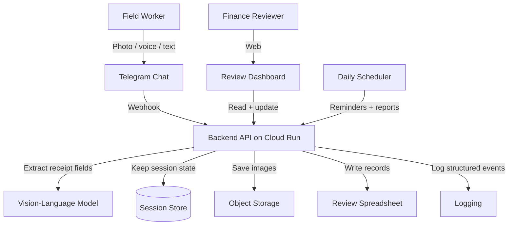

# AI Expense Assistant

> Public case study — sanitized for portfolio use.  
> Production system source: private corporate repository.

---

## Problem

Field workers in a large logistics company must file travel-expense reports after every trip. The old process was slow and error-prone:

- Workers kept paper receipts and filled forms by hand.
- They often forgot details like the merchant, date, or amount.
- Finance reviewers retyped the same data into spreadsheets.
- A simple trip report could take several days to close.

The company needed a way for workers to report expenses immediately from the field, without installing a new mobile app.

---

## Solution

A Telegram bot that acts as an AI expense assistant. Workers complete the whole report inside a chat they already know:

1. The worker creates a trip with a simple message like "Trip to Portville, three nights."
2. During the trip, the worker sends a photo of each receipt.
3. A vision-language model reads the receipt and extracts the amount, date, merchant, and currency.
4. The worker can correct any field with plain text or voice.
5. Shared expenses are split with travel companions using fuzzy name matching.
6. When the trip ends, the worker closes it and the final report is ready for finance review.

A web companion lets finance reviewers check exceptions and approve reports. The bot and the web view share the same backend data.

---

## Architecture

---

## Technology stack

- **Backend:** Python 3.11, FastAPI, Cloud Run
- **Chat interface:** Telegram Bot API via webhook
- **AI model:** Gemini 3 Flash Preview (vision + text)
- **Session persistence:** Firestore
- **Structured records:** Google Sheets as a lightweight review grid
- **Receipt images:** Google Cloud Storage
- **Frontend companion:** Next.js, React, TypeScript, Tailwind CSS
- **Authentication:** Firebase Authentication with Google sign-in
- **Scheduling:** Cloud Scheduler
- **Secrets:** cloud provider secret manager

---

## Key results

- Workers can file expenses in minutes instead of days.
- Receipt extraction reaches around 90 percent accuracy for common layouts.
- Finance reviewers spend far less time on data entry because the bot pre-fills most fields.
- The system supports text, voice, and photos, so it works in low-bandwidth field conditions.
- A global error handler guarantees the bot always replies, even when something fails.

---

## What makes the design interesting

1. **Hybrid interaction model.** A guided finite-state machine handles common flows, while a free-form mode lets advanced users describe expenses naturally. The same backend supports both styles.
2. **Multimodal input.** The worker can send a photo, a voice note, or plain text. The backend routes each input type to the right extractor.
3. **Companion sharing.** When several workers share one receipt, the bot matches companion names against the user roster with fuzzy search and splits the expense.
4. **Cost guardrails.** API calls to the language model are capped, logged, and checked against deterministic rules to avoid runaway spending.
5. **Cold-start resilience.** A global handler makes sure the bot responds to "hello" or any unexpected message, even when the service has just woken up.

---

## What is not in this repository

- The real Python source code, prompts, and parsers
- Database schemas, table names, or column indexes
- Cloud project IDs, service account keys, and webhook URLs
- The real Telegram bot token or API keys
- Internal business rules for approval limits and per-diem calculations
- Real receipt images or employee data
- Production deployment configuration
- The AppSheet back-office configuration used by finance admins

---

## Assets

- [`assets/architecture.mmd`](assets/architecture.mmd) — Mermaid source for the architecture diagram above
- [`assets/ui-demo.html`](assets/ui-demo.html) — static HTML mockup of a chat session
- [`assets/ui-demo.png`](assets/ui-demo.png) — exported PNG of the chat mockup

---

## Disclaimer

The actual production system is maintained in a private corporate repository. This public repository contains only a sanitized case study: problem description, generic architecture, technology stack, business impact, and illustrative mockups. No proprietary code or confidential information is included.
